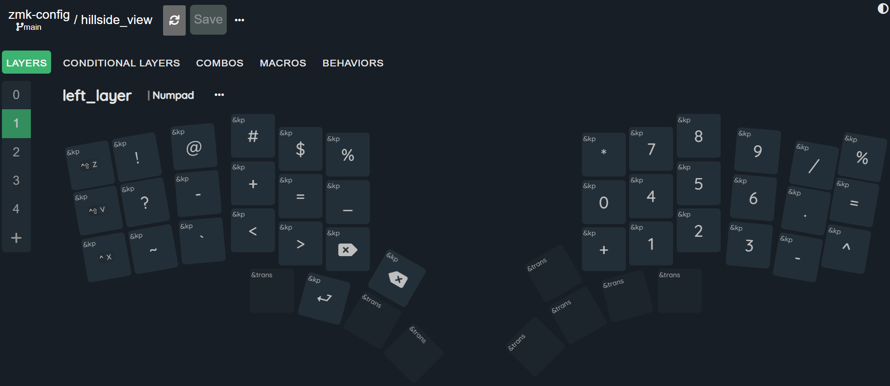

# README

Layout tool: https://nickcoutsos.github.io/keymap-editor/

## Dongle-Based Split Setup

This configuration uses an `nrf52840_mdk_usb_dongle` as the central, with both halves (`hillside_view_left` and `hillside_view_right`) acting as peripherals. Pointer events (glidepoint/cirque) and keys are relayed to the dongle over split.

Relay channels:
- Left virtual pointing device: channel 101
- Right physical glidepoint (resurrected virtually): channel 102

### Build Targets
| Device | Board | Shield |
| ------ | ------ | ------ |
| Left half | `nice_nano_v2` | `hillside_view_left nice_view_battery` |
| Right half | `nice_nano_v2` | `hillside_view_right nice_view_battery` |
| Dongle | `nrf52840_mdk_usb_dongle` | `keyboard_dongle` |
| Settings reset (optional) | `nice_nano_v2` | `settings_reset` |

### Flash Order
1. (Optional) Flash `settings_reset` onto each half to clear prior bonds. Then re-flash their normal firmware.
2. Flash left and right halves.
3. Flash dongle.

### Pairing Steps
1. Plug in dongle (central) via USB.
2. Power both halves. They will attempt to connect to the central automatically (split bond creation).
3. Put the dongle into BLE pairing mode (use a key mapped to `&bluetooth` or bootloader/pair combo if defined; otherwise temporarily build a keymap with a pairing key).
4. Pair the host computer to the dongle. Do NOT pair the halves directly to the host.
5. After pairing, key presses and pointing events from both halves should appear on the host.

### Verifying Pointer Relay
Right side: physical glidepoint (`glidepoint0`) -> relay channel 102 -> resurrected as `glidepoint_right` on dongle.
Left side: virtual input only (no hardware) -> relay channel 101 -> resurrected as `glidepoint_left` on dongle for keymap binding symmetry.

If pointer input from the right half is missing:
- Confirm both halves show connected status (LED behavior or via logs if enabled).
- Ensure channel numbers match: right overlay uses 102, dongle overlay has `input_relay_config_102_central`.
- Confirm `CONFIG_INPUT=y` and relay modules are present (west.yml contains the relay repos).

### Troubleshooting
- Stale bonds: Use `settings_reset` target and re-flash.
- Host sees two devices: Remove old bond to a former central (e.g., left half) from OS BT settings.
- No USB output: Verify dongle shield config has `CONFIG_ZMK_USB=y` and board supports USB (it does).

### Future Enhancements
- Add a pairing/status key or LED to the dongle (would then create a `keyboard_dongle.dtsi`).
- Add a battery reporting behavior if powering the dongle from a battery (currently USB powered).

